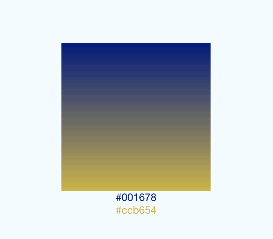

# Learn React Native

# Useful Resources

-   [React TypeScript Cheatsheet @github.com/typescript-cheatsheets](https://github.com/typescript-cheatsheets/react-typescript-cheatsheet)
-   [Learn the basics of destructuring props in React @freecodecamp.org](https://www.freecodecamp.org/news/the-basics-of-destructuring-props-in-react-a196696f5477)
-   [TypeScript Playground](https://www.typescriptlang.org/play)
-   [TypeScript Documentation](https://www.typescriptlang.org/docs/home.html)

# Day One

## Functions & Class Components

📄📄📄

-   [Function and Class Components @reactjs.org](https://reactjs.org/docs/components-and-props.html#function-and-class-components)
-   [How Are Function Components Different from Classes? @overreacted.io](https://overreacted.io/how-are-function-components-different-from-classes/)

🚧🚧🚧

Create a _Hello World!_ component using a function and using a class.

## Props

📄📄📄

-   [Component and Props @reactjs.org](https://reactjs.org/docs/components-and-props.html)
-   [Props @facebook.github.io/react-native](https://facebook.github.io/react-native/docs/props)

🚧🚧🚧

You probably already know a few programming related skills, for example - Git, JavaScript, TypeScript, React etc.

Let's write down some of the skills you know (up to five) in an app main view. Each of the skill must contain name and a logo or emoji of your choice. Since everything in React is about the reusability of the components, we are going to create a separate component called _Skill_ and pass props to it from _App_.

## State

📄📄📄

-   [State and Lifecycle @reactjs.org](https://reactjs.org/docs/state-and-lifecycle.html)
-   [State @facebook.github.io/react-native](https://facebook.github.io/react-native/docs/state)

🚧🚧🚧

Props exercise allowed us to render stateless list of the skills, but what if we would like to have some state for each of the skills? For example - how many hours we have spent on perfecting each them?

Let's update our _Skill_ component, it must have a counter of hours inside and when you tap on it - counter must increase by one hour.

You must understand one not really clear concept for many beginners - function can be passed as property, read more [Passing Functions to Components @reactjs.org](https://reactjs.org/docs/faq-functions.html)

Now _Skill_ component became **stateful** instead of **stateless**, read more [Stateful and Stateless Components in React @programmingwithmosh.com](https://programmingwithmosh.com/javascript/stateful-stateless-components-react/).

Is it possible to leave _Skill_ component stateless but lift up to _App_ component? It is called [lifting state up @reactjs.org](https://reactjs.org/docs/lifting-state-up.html).

## Style

📄📄📄

-   [Style @facebook.github.io/react-native](https://facebook.github.io/react-native/docs/style)
-   [Applying Basic Styles in React Native @egghead.io](https://egghead.io/lessons/react-applying-basic-styles-in-react-native)
-   [Style Components with StyleSheet @egghead.io](https://egghead.io/lessons/react-native-style-components-in-a-react-native-app-with-stylesheet)
-   [Using Styled Components with React Native @levelup.gitconnected.com](https://levelup.gitconnected.com/using-styled-components-with-react-native-de645fcf4787)

Why do we need to use _StyleSheet_? It is immutable, and fails if we will try to use non-existing property or pass wrong value to any of the properties.

🚧🚧🚧

Let's make our skill list cleaner, add:

-   title
-   background color
-   align & center skills
-   style each skill based on the hours spent, for example more hours makes it darker than others

Try styling the components using Styled Components.

## Height & Width

📄📄📄

-   [Height and Width @facebook.github.io/react-native](https://facebook.github.io/react-native/docs/height-and-width)

🚧🚧🚧

Make title to consume 25% of the screen height, do that using fixed dimensions and flex dimensions.

## Layout with Flexbox

📄📄📄

-   [Layout with Flexbox @facebook.github.io/react-native](https://facebook.github.io/react-native/docs/flexbox)
-   [Flex Direction @yogalayout.com](https://yogalayout.com/docs/flex-direction)

🚧🚧🚧

Let's just recreate an examples from the documentation [here](https://facebook.github.io/react-native/docs/flexbox).

## ScrollView / List Views

-   [Using a ScrollView @facebook.github.io/react-native](https://facebook.github.io/react-native/docs/using-a-scrollview)
-   [Using List Views @facebook.github.io/react-native](https://facebook.github.io/react-native/docs/using-a-listview)

🚧🚧🚧

Now let's get back to our previous _Skill_ component. What happens if there are 20 skills? And 20000?

## Built in Components

-   [Components and APIs](https://facebook.github.io/react-native/docs/components-and-apis.html)

## StoryBook [@storybook.js.org](https://storybook.js.org)

🚧🚧🚧

Navigate to [./index.js](./index.js), set `IS_STORYBOOK` property to `true`.

Now we are going to recreate screens from the [E-Commerce App Template](https://www.figma.com/file/fxBQAYFEsi7L4Oix12qaiF/E-commerce-Application-by-Fively-%2F-Dark), by the way there is also [a light theme available](https://www.figma.com/file/51dVhgTOHJtVoZCuN5RSVb/E-commerce-Application-by-Fively-%2F-Light)

Recreate screens in the following order:

- Sign Up Page
- Login Page
- Forgot Password
- Main 3
- Categories
- Catalog 2
- Product Card
- Product Card / Select Size
- My Bag
- My Bag / Checkout

# Day One - Home Assignment

Complete as much screens as you can for our E-Commerce App. 

# Day Two

## Adding SVG

📄📄📄

WTF is SVG? Basically it is an image which consists of vectors, in simpler words - just points and lines. When using SVG we can scale images endlessly without loosing quality.

- [Scalable Vector Graphics @wikipedia.org](https://en.wikipedia.org/wiki/Scalable_Vector_Graphics)
- [SVG Tutorial @w3schools.com](https://www.w3schools.com/graphics/svg_intro.asp)
- [SVG: Scalable Vector Graphics @developer.mozilla.org](https://developer.mozilla.org/en-US/docs/Web/SVG)

🚧🚧🚧

React-Native does not support SVG by default, but there are a library from the `react-native-community` for that - [react-native-svg](https://github.com/react-native-community/react-native-svg).

Using SVG draw:

 - few geometric figures using provided components
 - try to draw an examples found in [assets](./src/assets)
 - draw svg using file from the internet

## Images

📄📄📄

There is a separate section about the images in the documentation - [Images @facebook.github.io](https://facebook.github.io/react-native/docs/images).

- there is a special image handling for different screen densities

As mentioned already, images work very similary to `img` tag in html. Note a few differences, as stated in the - documentation - [Image @facebook.github.io](https://facebook.github.io/react-native/docs/image)

- you must manually specify width & height for the network images
- GIF & WebP does not work by default on Android

🚧🚧🚧

- draw icons found in [icons](./src/assets/icons) and note that quality does not suffer using png
- draw some random network images
- can you set an image as a background?
- what is [prefetch](https://facebook.github.io/react-native/docs/image#prefetch)?

## Gradient

📄📄📄

Unfortunately gradient does not work by default as well, there is yet another library from the `react-native-community` - [react-native-linear-gradient](https://github.com/react-native-community/react-native-linear-gradient)

🚧🚧🚧

We have a button in our *E-Commerce App* designs, try adding some gradient to it.

## Navigation

📄📄📄

One of the most complex parts in the mobile development is navigation. [Documentation @facebook.github.io](https://facebook.github.io/react-native/docs/navigation) suggests that you should use [React Navigation](https://reactnavigation.org/docs/en/getting-started.html).

There is one thing about [React Navigation](https://reactnavigation.org/docs/en/getting-started.html) - **YOU MUST READ THE DOCUMENTATION** to fully understand what you are doing.

🚧🚧🚧

- take a look at the guides, especially:
    - [Navigating](https://reactnavigation.org/docs/en/navigating.html)
    - [Passing parameters to routes](https://reactnavigation.org/docs/en/params.html)
    - [Tab navigation](https://reactnavigation.org/docs/en/tab-based-navigation.html)
    - [Drawer navigation](https://reactnavigation.org/docs/en/drawer-based-navigation.html)
    - [Type checking with TypeScript](https://reactnavigation.org/docs/en/typescript.html)

There are examples, which can be viewed on your phone using [Expo App](https://expo.io/tools).

When you think that you understand how it works, apply the knowledge to our *E-Commerce App*.

# Day Two - Home Assignment

- Go through the [React Navigation documentation](https://reactnavigation.org/docs/en/getting-started.html) at your own pace
- Complete navigation flow for our app as much as possible
- Get familiar with GraphQL, basic knowledge will be required:
    - [GraphQL Crash Course (in 10 pics!) @dev.to](https://dev.to/methodcoder/graphql-crash-course-in-10-pics-3b04)
    - [Introduction to GraphQL @graphql.org](https://graphql.org/learn)
    - [The Fullstack Tutorial for GraphQL @howtographql.com](https://www.howtographql.com)
    - [GraphQL Playground @graphqlbin.com](https://www.graphqlbin.com/v2/6RQ6TM) taken from [GraphQL Playground @github.com/prisma-labs](https://github.com/prisma-labs/graphql-playground)
- Not enough? Continue with an application screen from the day one!

# Day Three

## Fetching Data from the Internet

📄📄📄

Data fetching is pretty much the same as with plain old JavaScript, some documentation - [Ajax @developer.mozilla.org](https://developer.mozilla.org/en-US/docs/Web/Guide/AJAX)

🚧🚧🚧

For the sake of the exercise we are going to use [GraphQL](https://graphql.org) together with a [GraphCMS (headless CMS)](https://graphcms.com).

- In GraphCMS:
    - create a new project
    - create a `category` schema
    - create a `shop item` schema
    - add categories and items
    - fetch data using graphql in the *API Explorer*
    - expose query endpoint for a public use
- In your app:
    - add [React Apollo](https://www.apollographql.com) byt following [documentation @apollographql.com](https://www.apollographql.com/docs/react/integrations/react-native)
    - query the data ✨

## Adding an Authorization

📄📄📄

There are many solutions for an authorization:

- [Auth0](https://auth0.com)
- [AWS Cognito](https://aws.amazon.com/cognito), can be used with [AWS Amplify](https://aws.amazon.com/amplify) which has [React Native support](https://aws-amplify.github.io/docs/js/tutorials/building-react-native-apps)
- Direct integration through official or community packages, for example [Facebook](https://developers.facebook.com/docs/react-native/login), [Instagram](https://www.npmjs.com/package/react-native-instagram-login) 
- Or you can always build your authorization mechanism from scratch

This time we are going to use [Auth0](https://auth0.com), there is a [tutorial available @auth0.com](https://auth0.com/docs/quickstart/native/react-native/00-login)

🚧🚧🚧

- Create an account at [Auth0](https://auth0.com), there is a free tier available
- Add authorization to your application, by separating navigation stacks
- Store information about the user and authorization state in [async-storage @github.com/react-native-community](https://github.com/react-native-community/async-storage)

## Catching Bugs 🐞

📄📄📄

A matter of existential nature - how will you know if there was an exception on the customer device, and how are you going to find out the issue?

There are tools for that, for example [bugsnag](https://www.bugsnag.com)

🚧🚧🚧

- Create an account at [bugsnag](https://www.bugsnag.com), there is a free tier available
- Add integration by following the [React Native integration guide @https://docs.bugsnag.com](https://docs.bugsnag.com/platforms/react-native)

# Life After Workshop

## Few Designs to Replicate

- [Tasker (To-Do App)](https://www.figma.com/file/u4kxRfuUwvqn0HH8FUtd6l/Tasker)
- [Quantum Wallet (Finance App)](https://www.figma.com/file/wZJjBZoyaW5zj8xKD9oJK7/Quantum-wallet)
- [Hotel Booking](https://www.figma.com/file/iiH3O8o8iRXbjbmgT3bXw6/Hotel-Booking)
- or search something on your own [@figmafreebies.com](https://www.figmafreebies.com), [@figmacrush.com](https://www.figmacrush.com), [@freebiesui.com](https://freebiesui.com/figma-freebies) or just google _figma freebies_

## Newsletters Worth Subscribing

- [reactnative.cc](http://reactnative.cc)
- [reactnativenow.com](https://reactnativenow.com)

## Publishing App

- [Publishing to Google Play Store @facebook.github.io/react-native](https://facebook.github.io/react-native/docs/signed-apk-android)

## Animations

- [How to create a beautifully animated loader in React Native @freecodecamp.org](https://www.freecodecamp.org/news/how-to-create-a-beautifully-animated-loader-in-react-native-21da37a8f6b0/)
- [Animating Gradients in React Native @medium.com/@GroundControl](https://medium.com/@GroundControl/animating-gradients-in-react-native-8853dbd97d02)

## Other useful stuff

- [Localizing a React Native mobile app @codecentric.de](https://blog.codecentric.de/en/2019/11/localization-react-native-mobile-app-react-context-hooks)
- [An efficient way to structure React Native projects @cheesecakelabs.com](https://cheesecakelabs.com/blog/efficient-way-structure-react-native-projects)
- [Contextual Typography Styling in React Native @medium.com/@lewie9021](https://medium.com/@lewie9021/contextual-typography-styling-in-react-native-30d22df063a1)
- [List of Curated Resources @github.com/jondot/awesome-react-native](https://github.com/jondot/awesome-react-native)
- [React Native Shadow Generator @ethercreative.github.io](https://ethercreative.github.io/react-native-shadow-generator/)